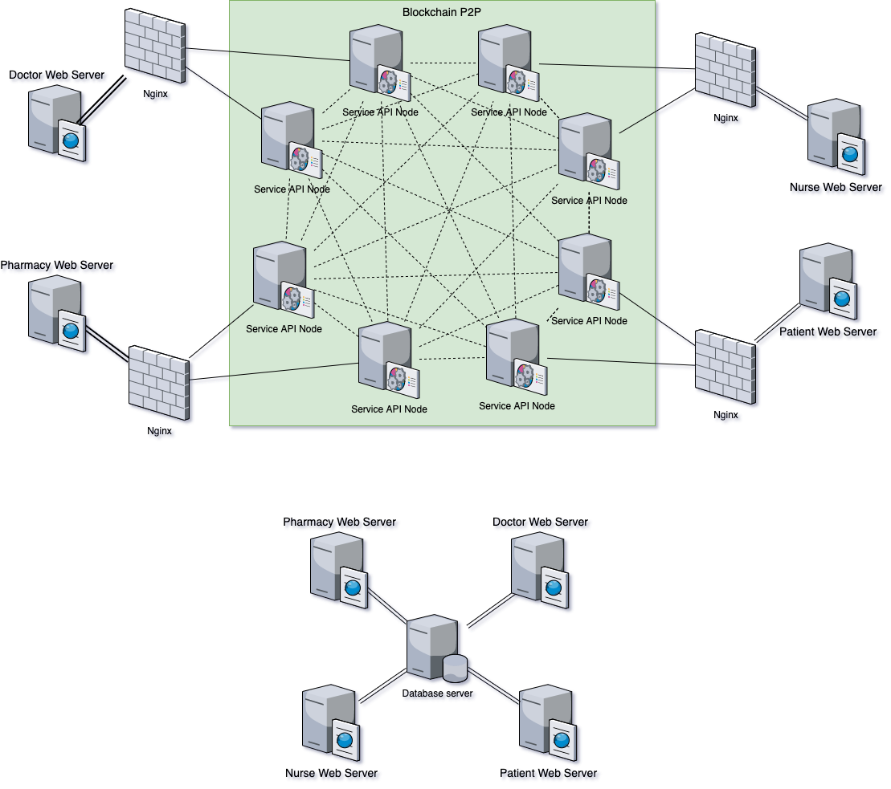

# **EMR**

## **Start**

```
git clone --recurse-submodules https://github.com/pokpack/EMR.git
cd ERD
npm install
```

___________
### **Ubuntu & MacOS**

```

HTTP_PORT=3001 P2P_PORT=6001 PEERS=ws://localhost:6002,ws://localhost:6003,ws://localhost:6004 SECRET_KEY=x]vf4yp0yf npm start
HTTP_PORT=3002 P2P_PORT=6002 PEERS=ws://localhost:6001,ws://localhost:6003,ws://localhost:6004 SECRET_KEY=x]vf4yp0yf npm start
HTTP_PORT=3003 P2P_PORT=6003 PEERS=ws://localhost:6001,ws://localhost:6002,ws://localhost:6004 SECRET_KEY=x]vf4yp0yf npm start
HTTP_PORT=3004 P2P_PORT=6004 PEERS=ws://localhost:6001,ws://localhost:6002,ws://localhost:6003 SECRET_KEY=x]vf4yp0yf npm start

curl -H "Content-type:application/json" -H "Authorization: Bearer x]vf4yp0yf" --data '{"data" : {"first_name": "firstname", "last_name" : "last_name"}}' http://localhost:3001/mineEMR

curl -H "Authorization: Bearer x]vf4yp0yf" http://localhost:3001/EMRs
curl -H "Authorization: Bearer x]vf4yp0yf" http://localhost:3001/EMRs/1

curl -H "Content-type:application/json" -H "Authorization: Bearer x]vf4yp0yf" --data '{"token" : "xxx"}' http://localhost:3001/newToken

```
___________
### **Window**

```

set HTTP_PORT=3001 && set P2P_PORT=6001 && set PEERS=ws://localhost:6002,ws://localhost:6003,ws://localhost:6004 && set SECRET_KEY=x]vf4yp0yf && npm start
set HTTP_PORT=3002 && set P2P_PORT=6002 && set PEERS=ws://localhost:6001,ws://localhost:6003,ws://localhost:6004 && set SECRET_KEY=x]vf4yp0yf && npm start
set HTTP_PORT=3003 && set P2P_PORT=6003 && set PEERS=ws://localhost:6001,ws://localhost:6002,ws://localhost:6004 && set SECRET_KEY=x]vf4yp0yf && npm start
set HTTP_PORT=3004 && set P2P_PORT=6004 && set PEERS=ws://localhost:6001,ws://localhost:6003,ws://localhost:6002 && set SECRET_KEY=x]vf4yp0yf && npm start


curl -H "Content-Type: application/json" -H "Authorization: Bearer x]vf4yp0yf" -X POST  http://localhost:3001/mineEMR -d "{\"data\":{\"user_id\": \"1\", \"fist_name\": \"fistname\", \"last_name\": \"lastname\"}}"

curl -H "Authorization: Bearer x]vf4yp0yf" GET http://localhost:3001/EMRs
curl -H "Authorization: Bearer x]vf4yp0yf" GET http://localhost:3001/EMRs/1

curl -H "Content-Type: application/json" -H "Authorization: Bearer x]vf4yp0yf" -X POST  http://localhost:3001/newToken -d "{\"data\": \"xxx\"}"

```

___________
### **Docker**


``` 
docker-compose up --build
```
___________
## **Routes**

```

  POST /api/:hn/admit/:emrId # หน้าแรกรับ
  POST /api/:hn/treat/:emrId # การรักษา
  POST /api/:hn/dispense/:emrId # เภสัชจ่ายยา
  POST /api/:hn/examination/:emrId # หมอ/พยาบาล วินิฉัย

  GET /api/admits # รายการ admit
  GET /api/treats # รายการ การรักษา
  GET /api/dispenses # รายการ เภสัชจ่ายยา
  GET /api/examinations # รายการ วินิฉัย

  GET /api/:hn/emr/:emrId # ข้อมูล เข้ารักษา
  GET /api/:hn/history # ข้อมูลประวัติ

 # :hn id ผู้ป่วย
 # :emrId id เข้ารักษา
 ```
___________
## **Diagram**



___________
## **Test**
### Server down 

```
docker-compose -f docker-compose.test.yml up --build

#call api
curl -H "Authorization: Bearer x]vf4yp0yf" GET http://localhost:8888/EMRs

docker-compose -f docker-compose.test.yml stop first_node

#call api again

docker-compose -f docker-compose.test.yml stop second_node
docker-compose -f docker-compose.test.yml start first_node

```
## Submodule

https://github.com/pokpack/frontend


